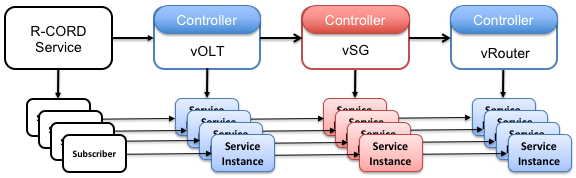

# Core Models

The XOS modeling framework provides a foundation for building systems
like CORD, but it is just a tool used to define a set of core models. It is
these core models that provide a coherent interface for configuring,
controlling, and applying policies to an operational system. This
gives operators a way to specify and reason about the system's
behavior, while allowing for a wide range of implementation choices
for the underlying software components.

## Services, Slices, and ServiceInstances

The XOS core starts with the **Service** model, which represents all
functionality that can be on-boarded into an XOS-managed system.
This model is designed to meet two requirements. The first is to be
implementation-agnostic, supporting both *server-based*
implementations (e.g., legacy VNFs running in VMs and micro-services
running in containers) and *switch-based* implementations (e.g.,
SDN control applications that install flow rules into white-box switches). The
second is to be multi-tenant, supporting isolated and virtualized instances
that can be created on behalf of both trusted and untrusted tenants.

To realize these two requirements, the Service model builds upon two other
models—**Slices** and **ServiceInstances**—as shown in the figure below.
Specifically, a Service is bound to one or more Slices, each of which
represents a distributed resource container in which the Service runs. This
resource container, in turn, consists of a scalable set of **Instances** (VMs
or containers) and a set of **Networks** that interconnect those VMs and
containers. Similarly, a Service is bound to one or more ServiceInstances, each
of which represents the virtualized partition of the service allocated to some
tenant.

Slices model the compute and network resources used to implement a service. By
creating and provisioning a Slice, the Service acquires the resources it needs
to run the VNF image or the SDN control application that defines its behavior.
Services are often bound to a single Slice, but multiple Slices are supported
for Services implemented as a collection of micro-services that scales
  independently.

ServiceInstances model the virtualized/isolated partition of the service
allocated to a particular tenant. It defines the context in which a tenant
accesses and controls its virtualized instantiation of the Service. In
practice, this means the ServiceInstance maintains tenant-specific state,
whereas the Service maintains Service-wide state.

How ServiceInstances isolate tenants—and the extent of isolation (e.g.,
namespace isolation, failure isolation, performance isolation)—is an
implementation choice. One option, as depicted by the dotted line in the figure
shown above, is for each ServiceInstance to correspond to an underlying compute
Instance. Because compute Instances provide isolation, the ServiceInstances are
also isolated. But this is just one possible implementation. A second is that
the ServiceInstance corresponds to a logically isolated partition of a
horizontally scalable set of compute Instances. A third example is that each
ServiceInstances corresponds to an isolated virtual network/channel implemented
by some SDN control application. These three example implementations correspond
to the vSG, vCDN, and vRouter Services in CORD, respectively.

One important takeaway is that ServiceInstances and compute Instances are not
necessarily one-to-one: the former represents a virtualized instance of a
service and the latter represents a virtualized instance of a compute resource.
Only in certain limited cases is the first implemented by the latter.

M-CORD’s vSGW Service is a fourth example, one that is worth calling out
because it does not fully utilize the degrees-of-freedom that the three models
provide. vSGW is representative of many legacy VNFs in that it requires only
one Slice that consists of a single VM (i.e., it does not necessarily leverage
the Slice’s ability to scale across multiple compute Instances). And because
the VNF was not designed to support multiple tenant contexts, there is no value
in creating ServiceInstances (i.e., there is only Service-wide configuration).
There is no harm in creating a ServiceInstance, representing the context in
which all subscribers use the vSGW service, but doing so is not necessary since
there is no need to control vSGW on a per-subscriber basis.

## Service Graphs and Service Chains

Given a set of Services (and their corresponding Slices and ServiceInstances),
XOS also defines two core models for interconnecting them:
**ServiceDependencies** and **ServiceInstanceLinks**. The first defines a
dependency of one Service on another, thereby forming a system-wide *Service
Graph*. The second defines a dependency between a pair of ServiceInstances,
thereby forming a per-subscriber *Service Chain*.

> NOTE: Service Graphs and Service Chains are not explicit models in XOS, but
> rather, they are defined by a set of vertices (Services, ServiceInstances)
> and edges (ServiceDependency, ServiceInstanceLink).

The following figure illustrates an example service graph configured into CORD,
along with an example collection of service chains. It does not show the
related Slices.

This example is overly simplistic in three ways. One, the Service Graph is not
necessarily linear. It generally forms an arbitrary mesh. Two, the Service
Chains are not necessarily isomorphic to the Service Graph nor equivalent to
each other. Each generally corresponds to a subscriber-specific path through
the Service Graph. The path corresponding to one subscriber may be different
from the path corresponding to another subscriber. Three, Service Chains are
also not necessarily linear. In general, a Service Chain may include “forks”
and “joins” that subscriber traffic might follow based on runtime decisions
made on a packet-by-packet for flow-by-flow basis.

ServiceDependencies effectively define a template for how ServiceInterfaceLinks
are implemented. For example, the ServiceDependency connecting some Service A
(the **subscriber_service**) to some Service B (the **provider_service**) might
indicate that they communicate in the data plane using one of the private
networks associated with Service B. In general, this dependency is
parameterized by a **connect_method** that defines how the two services are
interconnected in the underlying network data plane. The design is general
enough to interconnect two server-based services, two switch-based services, or
a server-based and a switch-based service pair. This makes it possible to
construct a service graph without regard to how the underlying services are
implemented.

The ServiceInterfaceLink associated with a ServiceInstance of A and a the
corresponding ServiceInstance of B would then record specific state about that
data plane connection (e.g., what address each is known by).

## Service-related Model Glossary

The XOS core models are defined by a set of [xproto](dev/xproto.md)
specifications. They are defined in their full detail in the source code (see
[core.xproto](https://github.com/opencord/xos/blob/master/xos/core/models/core.xproto)).
The following summarizes these core models—along with the key relationships
(bindings) among them—in words.

* **TrustDomain:** Trust domains represent a namespace where resources
  are often grouped together. This can be used to isolate groups of services
  from one another. There is typically a default `TrustDomain` provided.

* **Principal:** Principals provide identities for compute resources. For
  example, a `Principal` might convey a set of rights to perform operations on
  a particular API.

* **Service:** Represents an elastically scalable, multi-tenant program,
  including the declarative state needed to instantiate, control, and scale
  functionality.

    * Bound to a set of `Slices` that contains the collection of virtualized
      resources (e.g., compute, network) in which the `Service` runs.

    * Bound to a set of `ServiceInstances` that record per-tenant
      context for a virtualized partition of the `Service`.

  In many CORD documents you will see mention of each service also
  having a "controller" which effectively corresponds to the
  `Service` model itself (i.e., its purpose is to generate a "control
  interface" for the service). There  is no "Controller" model
  bound to a service. (Confusingly, XOS does include a `Controller`
  model, but it represents information about OpenStack. There is
  also a `ServiceController` construct in the TOSCA interface,
  which provides a means to load the `Service` model for
  a given service into XOS.)

* **ServiceDependency:** Represents a dependency between a *Subscriber* service
  on a *Provider*  service. The set of `ServiceDependency` and `Service` models
  collectively represent the edges and verticies of a *Service
  Graph*, but there is no explicit "ServiceGraph" model. The dependency
  between a pair of services is parameterized by the `connect_method` by which
  the service are interconnected in the data plane.Connect methods include:

    * **None:** The two services are not connected in the data plane.
    * **Private:** The two services are connected by a common private network.
    * **Public:** The two services are connected by a publicly routable
      network.

* **ServiceInstance:** Represents an instance of a service instantiated on
  behalf of a particular tenant. This is a generalization of the idea of a
  Compute-as-a-Service spinning up individual "compute instances," or using
  another common example, the `ServiceInstance` corresponding to a Storage
  Service might be called a "Volume" or a "Bucket." Confusingly, there are also
  instances of a `Service` model that represent different services, but this is
  a consequence of standard modeling terminology, whereas  `ServiceInstance` is
  a core model (and yes, there are instances of the `ServiceInstance`
  model).

* **ServiceInstanceLink:** Represents a logical connection between
  `ServiceInstances` of two `Services`. A related model, `ServiceInterface`,
  types the `ServiceInstanceLink` between two `ServiceInstances`. A connected
  sequence of `ServiceInstances` and `ServiceInstanceLinks` form what is often
  called a *Service Chain*, but there is no explicit "ServiceChain" model.

* **Slice:** Represents a distributed resource container that includes the
  compute and network resources that belong to (are used by) some `Service`.

    * Bound to a set of `ComputeServiceInstances` that provide compute resources for the
      `Slice`.

    * Bound to a set of `Networks` that connect the  slice's `Instances` to
      each other.

    * Bound to a default `Flavor` that represents a bundle of resources (e.g.,
      disk, memory, and cores) allocated to an instance. Current flavors borrow
      from EC2.

    * Bound to a default `Image` that boots in each of the slice's`ComputeServiceInstances`.
      Each `Image` implies a virtualization layer (e.g., Docker, KVM).

    * Optionally bound to a `TrustDomain` that specifies the namespace where the Slice's
      resources should be created.

    * Optionally bound to a `Principal` that permits compute resources of this
      slice to interact with APIs and other components.

* **ComputeServiceInstance:** This is derived from `ServiceInstance` and
  represents a single compute instance associated with a Slice
  and instantiated on some physical Node. A `ComputeServiceInstance`
  inherently links two services. The first is the service that realizes
  the compute resource, and is the `owner` of the
  `ComputerServiceIsntance`. An example is the `Kubernetes` service, which
  creates pods. The second is the service that owns the `Slice` that is
  linked to the `ComputeServiceInstance`. This is the service that
  is requesting the `ComputeServiceInstance`. The `ComputeServiceInstance`
  also includes an `image` field which describes the image that should
  be deployed. The `SimpleExampleService` service is a working example
  of the interplay between two services (`SimpleExampleService` and
  `Kubernetes`) via the `ComputeServiceInstance` model.

* **Network:** Represents a virtual network associated with a `Slice`. The
  behavior of a given `Network`is defined by a `NetworkTemplate`, which
  specifies a set of parameters, including `visibility` (set to `public` or
  `private`),  `access` (set to `direct` or `indirect`), `translation` (set to
  `none`or `nat`), and `topology_kind` (set to `bigswitch`, `physical` or
  `custom`). There is also a `vtn_kind` parameter (indicating the `Network` is
  manged by VTN), with possible settings: `PRIVATE`, `PUBLIC`,
  `MANAGEMENT_LOCAL`, `MANAGEMENT_HOST`, `VSG`, or `ACCESS__AGENT`.

* **Node:** Represents a physical server that can be virtualized and host
  resources

    * Bound to the `Site` where the `Node` is physically located.

* **User:** Represents an authenticated principal that is granted a set of
  privileges to invoke operations on a set of models, objects, and fields in
  the data model.

* **Privilege:** Represents the right to perform a set of read, write, or grant
  operations on a set of models, objects, and fields.

* **Site:** Represents a logical grouping of `Nodes` that are co-located at the
  same geographic location, which also typically corresponds to the nodes'
  location in the physical network. The current convention is that there is
  only one Site in the data model.

    * Bound to a set of `Nodes` located at the `Site`.

The above models comprise the core Service abstraction of XOS, but there are
additional models in the data model that provide additional features. For
example, there are models for initiating Backup and Restore and models for
controlling the appearance of the XOS GUI. Please see
[core.xproto](https://github.com/opencord/xos/blob/master/xos/core/models/core.xproto)
and/or separate documentation on these features for more information.
