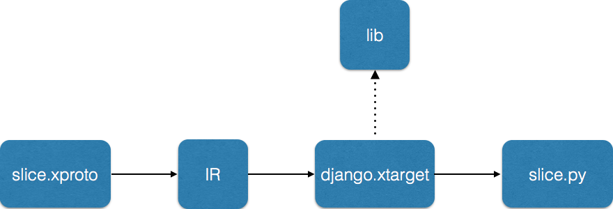

# XOS Modeling Framework

XOS defines a modeling framework: a language for specifying data models (_xproto_) and a tool chain for generating code based on the set of models (_xosgenx_).

The xproto language is based on [Google’s protocol buffers](https://developers.google.com/protocol-buffers/) (protobufs), borrowing their syntax, but extending their semantics to express additional behavior. Although these extensions can be written in syntactically valid protobufs (using the protobuf option feature), the resulting model definitions are cumbersome and the semantics are under-specified.

Whereas protobufs primarily facilitate one operation on models, namely, data serialization, xproto goes beyond protobufs to provide a framework for implementing custom operators. 

Users are free to define models using standard protobufs instead of the xproto syntax, but doing so obscures the fact that packing new behavior into the options field renders protobuf’s semantics under-specified. Full details are given below, but as two examples: (1) xproto supports relationships (foreign keys) among objects defined by the models, and (2) xproto supports boolean predicates (policies) that can be applied to objects defined by the  models.

The xosgenx tool chain generates code based on a set of models loaded into the XOS Core. This tool chain can be used to produce multiple targets, including:

* Object Relation Mapping (ORM) – maps the data model onto a persistent database.
* gRPC Interface – how all the other containers communicate with XOS Core.
* TOSCA API – one of the UI/Views used to access CORD.
* Security Policies – governs which principals can read/write which objects.
* Synchronizer Framework – execution environment in which Ansible playbooks run.
* Unit Tests – auto-generate API unit tests.

The next two sections describe xproto (first the models and then policies that can be applied to the models), and the following section describes xosgenx and how it can be used to generate different targets.

## Models

The xproto syntax for models is based on Google Protobufs. This means that any protobuf file also qualifies as xproto. We currently use the Protobuf v2 syntax. For example, the file below specifies a model that describes container images:

```protobuf
message Image {
     required string name = 1 [db_index = False, max_length = 256, null = False, content_type = "stripped", blank = False];
     required string kind = 2 [default = "vm", choices = "(('vm', 'Virtual Machine'), ('container', 'Container'))", max_length = 30, blank = False, null = False, db_index = False];
     required string disk_format = 3 [db_index = False, max_length = 256, null = False, content_type = "stripped", blank = False];
     required string container_format = 4 [db_index = False, max_length = 256, null = False, content_type = "stripped", blank = False];
     optional string path = 5 [max_length = 256, content_type = "stripped", blank = True, help_text = "Path to image on local disk", null = True, db_index = False];
     optional string tag = 6 [max_length = 256, content_type = "stripped", blank = True, help_text = "For Docker Images, tag of image", null = True, db_index = False];
}
```

We use standard protobuf scalar types, for example: `int32`, `uint32`, `string`, `bool`, and `float`.

xproto contains several extensions, encoded as Protobuf options, which the xosgenx toolchain recognizes at the top level. The xproto extensions to Google Protobufs are as follows.

### Inheritance

Inheritance instructs the xproto processor that a model inherits the fields of a set of base models. These base model fields are not copied into the derived model automatically. However, the fields can be accessed in an xproto target.

- xproto
  ```protobuf
  message EC2Instance (Instance, EC2Object) {
        // EC2Instance inherits the fields of  Instance
  }
  ```

- protobuf
  ```protobuf
  message EC2Instance  {
        option bases = "Instance,EC2Object"
  }
  ```

### Links

Links are references to one model from another. A link specifies the type of the reference (manytoone, manytomany, onetomany, or onetoone), name of the field that contains the reference (_slice_ in the following example), its type (e.g., _Slice_), the name of the field in the peer model that points back to the current model, and a “through” field, specifying a model declared separately as an xproto message, that stores properties of the link.

- xproto
  ```protobuf
  message Instance {
        required manytoone slice:Slice->instances = 1;
  }
  ```

- protobuf
  ```protobuf
  message Instance {
        required int32 slice = 1 [model="Slice", link="manytoone", src_port="slice", dst_port="instances"];
  }
  ```

The example shown below illustrates a manytomany link from Image to Deployment, which goes through the model `ImageDeployments`:

- xproto
  ```protobuf
  required manytomany deployments->Deployment/ImageDeployments:images = 7 [help_text = "Select which images should be instantiated on this deployment", null = False, db_index = False, blank = True];
  ```

- Protobuf
  ```protobuf
  required int32 deployments = 7 [help_text = "Select which images should be instantiated on this deployment", null = False, db_index = False, blank = True, model="Deployment", through="ImageDeployments", dst_port="images", link="manytomany"];
  ```

### Access Policies

Associates a policy (a boolean expression) with a model  to control access to instances of that model. How policies (e.g., `slicle_policy`) are specified is described below.

```protobuf
message Slice::slice_policy (XOSBase) {
…
}
```

### Model Options

Model Options declare information about models. They can be declared for individual models, or at the top level in the xproto definition, in which case they are inherited by all of the models in the file, unless they are overridden by a particular model.

Currently supported model options include: `name`, `app_label`, `verbose_name`, `legacy`, `tosca_description`, `validators`, `plural`, `singular`, and `gui_hidden`.

The name option is a short name used to refer to your service. For example, in the Virtual Subscriber Gateway service, the name option is set to `vSG`. 

```protobuf
option name = "vSG"
```

The app\_label option is a short programmatic name that does not need to be easily understood by humans. It should not include whitespaces, and should preferrably be all lowercase. If app\_label is not specified, then its value defaults to the name option described above.

```protobuf
option app_label = "vsg"
```

The verbose\_name option contains a short description of the service.

```protobuf
option verbose_name = "Virtual Subscriber Gateway Service";
```


```protobuf
option app_label = "legacy"
```

The legacy option is for services that require custom Python code in their
generated models. Without this option set, for any given model (`VSGService`) the
toolchain generates model classes in a self-contained file (`vsgservice.py`).
With this option set, the toolchain generates the models in a file called
`vsgservice_decl.py`. All of the models in this file have the suffix `_decl`.
It is then up to the service developer to provide the final models. The code below gives
an example of custom models that inherit from such intermediate `decl` models:

```python
class VSGService(VSGService__decl):
    def __xos_base_save(self, *args, **kwargs):
        self.prop1 = self.prop2 + self.prop3
    pass
```

You can use the xproto `service_extender` target to generate a stub for your
final model definitions.

The plural and singular options provide the grammatically correct plural and singular forms of your model name to ensure that autogenerated API endpoints are valid.

```protobuf
option singular = "slice" # Singular of slice is not slouse, as computed by Python's pattern.en library

option plural = "ports" # Plural of ports is not portss
```

The tosca\_description option is a description for the service entry in the autogenerated TOSCA schema.

The `validators` option contains a set of declarative object validators applied to every object of the present model when it is saved. Validators are a comma separated
list of tuples, where the two elements of each tuple are separated by a ':'. The first element of the tuple is a reference to an XOS policy (described in another section of this document). The second element is an error message that is returned to an API client that attempts an operation that does not pass validation.

```protobuf
option validators = "instance_creator:Instance has no creator, instance_isolation: Container instance {obj.name} must use container image, instance_isolation_container_vm_parent:Container-vm instance {obj.name} must have a parent";
```

The gui\_hidden option is a directive to the XOS GUI to exclude the present model from the default view provided to users.

```protobuf
option null = True
```

### Field Options

Options are also supported on a per-field basis. The following lists the currently available field options.

The null option specifies whether a field has to be set or not (equivalent to annotating the field as `required` or `optional`):

```protobuf
option null = True
```

Help text describes a field:

```protobuf
option help_text = “Descriptive text goes here”;
```

The default value of the field:

```protobuf
option default = “Default value of field”;
```

The maximum length of a field whose type is string:

```protobuf
option max_length = 128;
```

Whether a field can be empty:

```protobuf
option blank = False;
```

A label to be used by the GUI display for this field:

```protobuf
option verbose_name = “Verbose name goes here”;
```

Do not display this field in the GUI (also available at the model level):

```protobuf
option gui_hidden = True;
```

The set of valid values for a field, where each inner-tuple specifies equivalence classes (e.g., vm is equivalent to Virtual Machine):

```protobuf
option choices = "(('vm', 'Virtual Machine'), ('container', 'Container'))";
```

Whether the field is an index field, that is, is used by database targets:

```protobuf
option db_index = True;
```

How to interpret/parse string fields:

```protobuf
option content_type = “stripped”;
option content_type = “date”;
option content_type = “url”;
option content_type = “ip”;
```

Whether an assignment to a field is permitted, where the option setting is a named policy:

```protobuf
option validators = “port_validator:Slice is not allowed to connect to network”;
```
How policies (e.g., `port_validator`) are specified is described below.

Whether a field should be shown in the GUI:

```protobuf
option gui_hidden = True;
```

Identify a field that is used as key by the TOSCA engine. A model can have multiple keys in case we need a composite key:

```protobuf
option tosca_key = True;
```

### Naming Conventions

Model names should use _CamelCase_ without underscore. Model names should always
be singular, never plural. For example: `Slice`, `Network`, `Site`.

Sometimes a model is used to relate two other models, and
should be named after the two models that it relates. For example, a model that
relates the `Controller` and `User` models should be called `ControllerUser`.

Field names use lower-case with underscores separating names. Examples of
valid field names are: name, `disk_format`, `controller_format`.

### Declarative vs Feedback State 

By convention, the fields that make up a model are classified as
holding one of two kinds of state: *declarative* and *feedback*.

Fields set by the operator to specify (declare) the expected state of
CORD's underlying components are said to hold *declarative state*.
In contrast, fields that record operational data reported from CORD's
underlying (backend) components are said to hold *feedback state*.

For more information about declarative and feedback state, and the
role they play in synchornizing the data model with the backend
components, read about the [Synchronizer Architecture](sync_arch.md). 

## Policies

Policies are boolean expressions that can be associated with models. Consider two examples. In the first, `grant_policy` is a predicate applied to instances of the `Privilege` model. It is used to generate and inject security checks into the API.

```protobuf
policy grant_policy < ctx.user.is_admin
                      | exists Privilege:Privilege.object_type = obj.object_type
                        & Privilege.object_id = obj.object_id
                        & Privilege.accessor_type = "User"
                        & Privilege.accessor_id = ctx.user.id 
                        & Privilege.permission = "role:admin" >
    
message Privilege::grant_policy (XOSBase) {
     required int32 accessor_id = 1 [null = False];
     required string accessor_type = 2 [null = False, max_length=1024];
     required int32 controller_id = 3 [null = True];
     required int32 object_id = 4 [null = False];  
     required string object_type = 5 [null = False, max_length=1024];
     required string permission = 6 [null = False, default = "all", max_length=1024];
     required string granted = 7 [content_type = "date", auto_now_add = True, max_length=1024];
     required string expires = 8 [content_type = "date", null = True, max_length=1024];
}
```

The policy is executed relative to three implied inputs:

* The object on which the policy is invoked (e.g., `obj.object_type`).
* The context in which the policy is invoked (e.g., `cxt.user`).
* The data model as a whole (e.g., `exists Privilege:Privilege.accessor_id = ctx.user.id`).

Available context information includes the principal that invoked the operation (`ctx.user`) and the type of access that principal is requesting (`ctx.write_access` and `ctx.read_access`).

A second example involves the `Port` model and two related policies, `port_validator` and `port_policy`. 

```protobuf
policy port_validator < (obj.instance.slice in obj.network.permitted_slices.all()) | (obj.instance.slice = obj.network.owner) | obj.network.permit_all_slices >
policy port_policy < *instance_policy(instance) & *network_policy(network) >

message Port::port_policy (XOSBase) {
     option validators = "port_validator:Slice is not allowed to connect to network";
     required manytoone network->Network:links = 1 [db_index = True, null = False, blank = False, unique_with = "instance"];
     optional manytoone instance->Instance:ports = 2 [db_index = True, null = True, blank = True];
     optional string ip = 3 [max_length = 39, content_type = "ip", blank = True, help_text = "Instance ip address", null = True, db_index = False];
     optional string port_id = 4 [help_text = "Neutron port id", max_length = 256, null = True, db_index = False, blank = True];
     optional string mac = 5 [help_text = "MAC address associated with this port", max_length = 256, null = True, db_index = False, blank = True];
     required bool xos_created = 6 [default = False, null = False, db_index = False, blank = True];
}
```

Similar to the previous example, `port_policy` is associated with the `Port` model, but unlike `grant_policy` shown above (which is an expression over a set of objects in the data model), `port_policy` is defined by reference to two other policies: `instance_policy` and `network_policy` (not shown). 

This example also shows the use of _validators_, which enforce invariants on how objects of a given model are used. In this case, policy `port_validator` checks to make sure the slice associated with a given port is included in the set of permitted networks.

Policy expressions may include the following operators:
conjunction ( `&` ),
disjunction ( `|` ),
equality ( `=` ),
negation ( `not` ),
set membership ( `in` ),
implication ( `->` ),
qualifiers ( `exists`, `forall` ),
sub-policy reference ( `* <policy name>` ),
python escapes (`{{ python expression }}`).

## Tool Chain

The xosgenx tool converts a xproto file into an intermediate representation and passes it to a target, which in turn generates the output code. The target has access to a library of auxiliary functions implemented in Python. The target itself is written as a jinja2 template. The following figure depicts the processing pipeline.



### Intermediate Representation (IR)

The IR is a representation of a parsed xproto file in the form of nested Python dictionaries. Here is a description of its structure.

```protobuf
"proto": {
    "messages": [
         {"name": "foo", fields: [{...}], links: [{...}], rlinks: [{...}], options: [{...}]}
    ]
},
"context": {
    "command line option 1": "value - see the --kv option of xosgenx"
},
"options": {
    "top level option 1": "value of option 1"
}
```

### Library Functions

xproto targets can use a set of library functions implemented in Python. These can be found in the file `lib.py` in the `genx/tool` directory. These functions are listed below:

- `xproto_unquote(string)` Unquotes a string. For example, `"This is a help string"` is converted into `This is a help string.`  
  
- `xproto_singularize(field)` Converts an English plural into its singular. It is extracted from the `singular` option for a field if such an option is specified. Otherwise, it performs the conversion automatically using the library `pattern.en`.

- `xproto_pluralize(field)` The reverse of `xproto_singularize`.

### Targets

A target is a template written in jinja2 that takes the IR as input and generates code (a text file) as output. Common targets are Python, Protobufs, unit tests, and so on. The following example shows how to generate a GraphViz dot file from a set of xproto specifications:

```python
digraph {

  
  {{ m.name }} -> {{ l.peer }};
  

}
```

This template loops through all of the messages in a proto definition and then through the links in each message. For each link, it formats and outputs an edge in a graph in Graphviz dot notation.

```
{{ proto }}
```

This target simply prints the IR for an xproto definition.

```python


    def enumerate_{{ xos_singularize(r) }}_ids:
        return map(lambda x:x['id'], {{ xos_pluralize(r) }})


```

The example target outputs a Python function that enumerates the ids of the objects from which the current object is linked.

### Running xosgenx

It is possible to run the xosgenx tool chain directly. This is useful, for example, when developing a new target.

To do do, first setup the python virtual environment as described [here](local_env.md). Then drop an xproto file in your working directory. For example, you can copy-and-paste the following content into a file named `slice.xproto`:

```protobuf
message Slice::slice_policy (XOSBase) {
     option validators = "slice_name:Slice name ({obj.name}) must begin with site login_base ({ obj.site.login_base}), slice_name_length_and_no_spaces:Slice name too short or contains spaces, slice_has_creator:Slice has no creator";
     option plural = "Slices";

     required string name = 1 [max_length = 80, content_type = "stripped", blank = False, help_text = "The Name of the Slice", null = False, db_index = False];
     required bool enabled = 2 [help_text = "Status for this Slice", default = True, null = False, db_index = False, blank = True];
     required string description = 4 [help_text = "High level description of the slice and expected activities", max_length = 1024, null = False, db_index = False, blank = True, varchar = True];
     required string slice_url = 5 [db_index = False, max_length = 512, null = False, content_type = "url", blank = True];
     required manytoone site->Site:slices = 6 [help_text = "The Site this Slice belongs to", null = False, db_index = True, blank = False];
     required int32 max_instances = 7 [default = 10, null = False, db_index = False, blank = False];
     optional manytoone service->Service:slices = 8 [db_index = True, null = True, blank = True];
     optional string network = 9 [blank = True, max_length = 256, null = True, db_index = False, choices = "((None, 'Default'), ('host', 'Host'), ('bridged', 'Bridged'), ('noauto', 'No Automatic Networks'))"];
     optional string exposed_ports = 10 [db_index = False, max_length = 256, null = True, blank = True];
     optional manytoone creator->User:slices = 12 [db_index = True, null = True, blank = True];
     optional manytoone default_flavor->Flavor:slices = 13 [db_index = True, null = True, blank = True];
     optional manytoone default_image->Image:slices = 14 [db_index = True, null = True, blank = True];
     optional manytoone default_node->Node:slices = 15 [db_index = True, null = True, blank = True];
     optional string mount_data_sets = 16 [default = "GenBank", max_length = 256, content_type = "stripped", blank = True, null = True, db_index = False];
     required string default_isolation = 17 [default = "vm", choices = "(('vm', 'Virtual Machine'), ('container', 'Container'), ('container_vm', 'Container In VM'))", max_length = 30, blank = False, null = False, db_index = False];
}
```

One of the existing targets is Django, which currently serves as the Object-Relational Mapping (ORM) tool used in CORD. To generate a Django model starting from this xproto file you can use:

`xosgenx --target="django.xtarget" --output=. --write-to-file="model" --dest-extension="py" slice.xproto`

This generates a file called `slice.py` in your current directory. If there were multiple files, then it generates python Django models for each of them.

You can print the tool’s syntax by running `xosgenx --help`.

```
usage: xosgenx [-h] [--rev] --target TARGET [--output OUTPUT] [--attic ATTIC]
               [--kvpairs KV] [--write-to-file {single,model,target}]
               [--dest-file DEST_FILE | --dest-extension DEST_EXTENSION]
               <input file> [<input file> ...]

XOS Generative Toolchain

positional arguments:
  <input file>          xproto files to compile

optional arguments:
  -h, --help            show this help message and exit
  --rev                 Convert proto to xproto
  --target TARGET       Output format, corresponding to <output>.yaml file
  --output OUTPUT       Destination dir
  --attic ATTIC         The location at which static files are stored
  --kvpairs KV          Key value pairs to make available to the target
  --write-to-file {single,model,target}
                        Single output file (single) or output file per model
                        (model) or let target decide (target)
  --dest-file DEST_FILE
                        Output file name (if write-to-file is set to single)
  --dest-extension DEST_EXTENSION
                        Output file extension (if write-to-file is set to
                        single)
```
