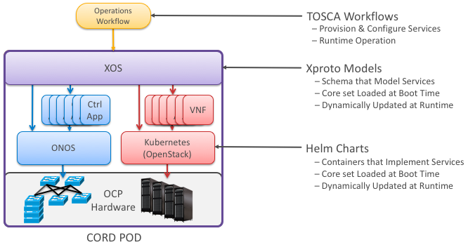

# Example Use Case

This section gives a brief overview of lifecycle management in CORD,
illustrating the role XOS plays in operationalizing a system built from
a collection of disaggregated services.

As depicted in this diagram, CORD is built from a collection of SDN Control
Apps running on ONOS, plus a collection of VNFs running in OpenStack
VMs and/or Kubernetes containers. Operationalizing these components
involves the following three layers:

* **Installation (Helm):** Installing CORD means installing a collection
  of Docker containers in a Kubernetes cluster. CORD uses Helm to carry
  out the installation, with the valid configurations defined by a set of
  `helm-charts`. Among the containers deployed by Helm are ones that
  implement CORD's management plane, including XOS.

* **Operations (TOSCA):** A running CORD POD supports multiple Northbound
  Interfaces (e.g., a GUI and REST API), but CORD typically uses `TOSCA` to specify
  a workflow for configuring and provisioning a running system. A freshly
  installed CORD POD has a set of control plane and platform level containers
  running (e.g., XOS, ONOS, OpenStack), but until provisioned using `TOSCA`,
  there are no active services or service graph.

* **Integration (XOS):** XOS implements a middle layer that connects the
  NBI(s) to the backend components. It takes an `xproto` model schema
  for all the services that are to be included in CORD as input, and generates
  the code needed to integrate (on-board) those componets. This includes the
  TOSCA engine used to process the configuration and provisioning workflows.

The resulting system is dynamic. Bringing up new services involves deploying
new helm charts and loading new models into XOS, which in turn triggers an
upgrade and restart of the TOSCA engine. Upgrading an existing service is
similar: Kubernetes incrermentally rolls out the containers that implement
the service (and rollbacks them back if necessarily), and XOS migrates from
the old model to the new model (and supports both old and new APIs during
the transition period).

