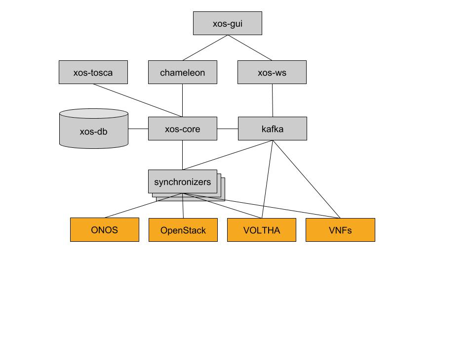

# XOS Containers

When deployed, XOS runs as a set of Docker containers that cooperate to provide platform
controller functionality, including the data model, synchronizers, and northbound
APIs. The following is an inventory of those containers:

| Name | Description | Internal Ports |
| ---- | ----------- | ----- |
| xos-core | The core of the platform; responsible for maintaining the data model | 50051, 500515 |
| xos-db | A Postgres instance; used to persist the data model | 5432 |
| xos-redis | A Redis instance; used as pub/sub channel for internal notifications | 5432 |
| xos-tosca | Northbound TOSCA interface; accessible via REST | 9102|
| xos-gui | Northbound GUI dashboard| 4000|
| xos-ws | Listens to `redis` events and propagates them over web-sockets | 3000|
| xos-chameleon | Northbound REST interface; accessible at `/xosapi/v1/..` (`swagger` is published at `/apidocs/`| 3000|
| kafka | A Kafka bus; used by some backend components to send event notifications | 9092|

All the communication between containers happen over `gRPC` except for
`xos-gui`, which uses a combination of REST and web-socket.

> **Note:** The dotted lines identify optional components that are
> required only in certain configurations.

