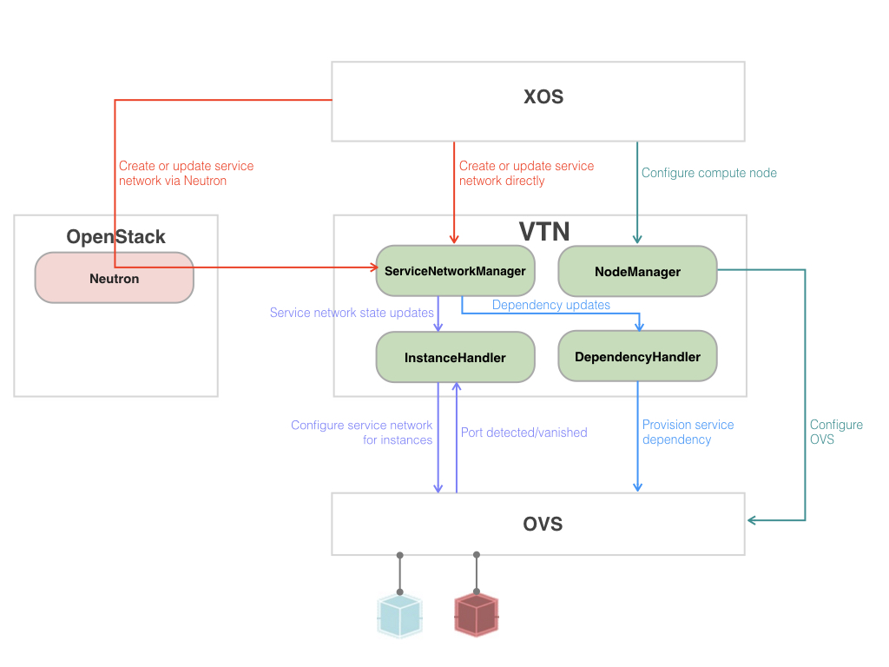

# VTN and Service Composition

CORD's support for service composition depends on VTN. The following focuses on
the interface VTN exports, and how XOS interacts with VTN interconnect
services. For more information about VTN’s internals and its relationship to
the CORD fabric, see the
[Trellis](https://wiki.opencord.org/display/CORD/Trellis%3A+CORD+Network+Infrastructure)
documentation.

## VTN-Provided Networks

Each Service is connected to one or two *Management Networks* and one or more
*Data Networks*. VTN implements both types of networks.

VTN defines two management networks that instances can join:

* **MANAGEMENT_LOCAL:** This puts the instance on the 172.27.0.0/24 network,
  which is limited to the local compute node. The compute node's root context
  is always 172.27.0.1 on this local network. Synchronizers currently use this
  network to SSH into an Instance to configure it. They SSH to the compute
  node's root context, and then from there into the Instance.

* **MANAGEMENT_HOST:** This puts the instance on the 10.1.0.0/24 network that
  does span compute nodes and does offer end-to-end connectivity to the head
  node. This network currently runs over the physical management network.

These two management networks are completely independent. A Slice can choose to
participate in either of them, neither of them, or both of them. In the latter
case, each instance has two management interfaces, one with a 172.27.0.0/24
address and one with a 10.1.0.0/24 address. Instances on different compute
nodes can talk to each other on MANAGEMENT_HOST, but they cannot talk to each
other on MANAGEMENT_LOCAL.

> NOTE: These two management networks are entirely configurable: 172.27.0.0/24
> and 10.1.0.0/24 are what been set for CORD-in-a-Box but need not necessarily
> be the same on a physical POD.

The rest of this guide focuses on the Data Network, which connects all the
instances in a Service to each other (by default), but optionally can also
connect that network to other networks in CORD. VTN is responsible for both
implementing the base (default) Data Network and for splicing that network to
other networks. These “other” networks are provided by both VTN (i.e., the
other network is some other Service’s base Data Network) and by other CORD
services (e.g., vOLT, vRouter).

When first created, each Data Network is *Private* by default, analogous to a
private network in OpenStack (i.e., it connects only the Instances in the
Service). The network can remain private, or it can be connected onto one or
more other networks. These other networks can themselves be the Data Network of
some other Service, but it is also possible to connect a Service’s Data Network
to the public Internet, making the Instances Internet-routable. This framing of
how to connect a Service to the public Internet is unusual (i.e., one connects
to a public network by augmenting an existing a Private network), but it is
helpful to view the public Internet being just like any other network in CORD:
it is provided by some service. In the case of the public Internet, this
service is currently provided by vRouter.

> Note: While it is natural to expect an Instance to connect directly to a
Public network (as opposed to first connecting to a private network and then
splicing that network to a public network), that exploits a race condition
involving Neutron. Should Neutron have had the opportunity to come up before
the public network is connected, a private address rather than a public address
would be assigned to each Instance's Port. Instead, our approach is that (a)
the private network be established as a first step, and (b) it is possible to
assign a second address (in this case public) to each Port. This allows a
private network to be made public at any time, and in general, being able to
assign multiple addresses to a Port is a requirement.

In addition to adding public connectivity to a private network, it is also
possible to create a network that is public by default. This is done by setting
the network's template's `VTN_KIND` to `public`.

## Interconnecting Networks

VTN programs the underlying software switches (e.g., OvS) to forward packets
to/from the Ports of the Service’s Instances. Connecting a network onto an
existing Data Network means Instances in the two networks can exchange packets
according to the parameters of the splicing operation (see below) and it may
result in a new address being assigned to each Port.

A Service’s Data Network is interconnected to other networks as a consequence
or the corresponding Services being composed in the Service Graph. There are
four cases, depending on whether the two services being composed are
implemented in the network control plane or the network data plane. We start
with the example most people assume (the two services implement VNFs in the
data plane), and then show how the same principle generalizes to other possible
compositions.

When a dependency is established between a pair of data plane services, denoted
A → B, it causes the Data Networks of A and B to be interconnected according to
attribute’s assigned to their respective Data Networks. (To simplify the
discussion we assume each Service has one Slice and each Slice has one Network.
In practice, it is necessary to specify which of the Service’s Networks are
being interconnected.) Two attribute vectors are (currently) defined:

* *Direct* vs *Indirect*

* *Unidirectional* vs *Bidirectional*

The first defines whether A uses *Direct* addressing for the Instances of B
(using a unique address for each Instance) or *Indirect* addressing (using a
Service-wide address, where VTN implements load balancing by forwarding the
packet to a specific Instance). The second defines whether communication is
*Unidirectional* (A can send packets to B but not vice versa) or
*Bidirectional* (A and B can send packets to each other).

Technically, these attributes are associated with Service B’s Network rather
than with the interconnection of A to B. When A interconnects with B, the
properties of B’s Data Network dictate the terms of the interconnection. But as
we expand the capability, it may be possible that attributes of the
interconnection will be specified with the interconnection model rather than
one or other of the networks being interconnected.

The above corresponds to a service implemented by one set of Instances being
composed with a service implemented by another set of Instances. This results
in two VTN-implemented Data Networks being connected together. Because VTN
allocates a disjoint block of addresses drawn from a common private address
space to each Data Network, this means a new block of addresses becomes visible
to (routable from) each Service; each Instance continues to have the same
private IP address assigned to its Ports.

In general, however, one or both of A and B might be “control plane” Services,
in which case it implements a network rather than uses a network. Two examples
are vOLT and vRouter, meaning we have two “mixed” service interconnections:

* vOLT → vSG (a control plane service connects to a data plane service)

* vSG → vRouter (a data plane service connects to a control plane service)

What this means is that rather than VTN splicing together two VTN-based Data
Networks, we are asking VTN to connect some “other” network to the VTN-defined
Data Network.

Similarly, this generalizes to account for other Networks-as-a-Service; e.g.,

* vSG → vNaaS (a container connects to a wide-area virtual
  Network-as-a-Service)

Finally, although VTN does not yet support this case, one can imagine a
situation where one control plane service connects to another control plane
service, in which case VTN will need to interconnect two networks (neither of
which VTN implements itself). For example:

* vOLT → vRouter (from R-CORD)

* vEE → vNaaS (from E-CORD)

Looking across this set of examples, there are two subcases. In the first, when
interconnecting two VTN-based networks, the result is basically the union of
the two original networks (with restrictions). In the second, when
interconnecting a Service to some ONOS-provided network, the result is to
dynamically add the ServiceInstances to that new network, with the side-effect
of the instances being assigned a new address on that network. These two
subcases can be traced back to the two roles VTN plays: (1) it connects
instances to networks, and (2) it provides a private network for a set of
instances.

## Components and Interfaces

Two interfaces (one provided by VTN and the other provided by XOS) are
necessary to support service composition. XOS invokes the VTN-provided API to
interconnect networks belonging to two composed services. VTN invokes the
XOS-provided API to restore interconnection state (e.g., if VTN restarts), but
this interface is not involved in typical XOS/VTN interaction. The following
diagram shows the relationship between XOS, OpenStack Neutron, and the various
sub-systems of VTN.



In a configuration that includes OpenStack, XOS indirectly calls VTN via
Neutron. In this case, Neutron's ML2 plugin informs OpenStack Nova about the
virtual network connecting a set of instances. XOS can also create a virtual
network by directly calling VTN without Neutron's involvement (e.g,. to
interconnect Docker containers).

Because VTN provides a CLI to purge its internal state, it uses the
XOS-provided API to resync with XOS. This VTN-to-XOS interface is not shown in
the figure.

## XOS Provided API

* `GET xosapi/v1/vtn/vtnservices` Get a list of VTN services
* `PUT xosapi/v1/vtn/vtnservices/{service_id}` Update a VTN service

To cause VTN to be resynchronized from XOS to the VTN app, the following steps
are performed:

1. `GET xosapi/v1/vtn/vtnservices/` This will provide a list of registered VTN
   services. There's usually only one, and it's `id` is typically set to `1`,
   but we recommend always getting the list of services rather than assuming an
   the id.

2. `PUT xosapi/v1/vtn/vtnservices/{service_id}` with data `{"resync": true}`.
   `{service_id}` is the identifier you retrieved in step (1).

## VTN Provided API

### ServicePorts

* `POST onos/cordvtn/servicePorts`  Create a service port

* `GET onos/cordvtn/servicePorts`  List service ports including service port
  details

* `GET onos/cordvtn/servicePorts/{port_id}`  Show service port details

* `DELETE onos/cordvtn/servicePorts/{port_id}`  Delete a service port

#### Service Port Details

| Parameters | Type | Description |
| --------- | ---- | --------- |
| id * | UUID | The UUID of the service port.|
| network_id * | UUID | The UUID of the attached service network.|
|name * | string | The name of the port on the switch.|
|vlan_id | number | VLAN ID of the port interface.|
| mac_address | string | The MAC address of the port interface.|
| ip_address | string | The IP address of the port interface.|
| floating_address_pairs | list | Additional public addresses allowed to the port interface.|
| ip_address | string | Additional public IP address.|
| mac_address | string | Additional MAC address mapped to the public IP address.|

> NOTE: `*` fields are mandatory for creating a new service port.

Example json request:

```json
{
   "ServicePort":{
      "id":"b8ba3d85-1dec-49f9-8503-6f1b90399152",
      "network_id":"0f30807c-fce0-4fa5-9c36-99ff6d4d0ae1",
      "name":"tapb8ba3d85-1d",
      "vlan_id":222,
      "mac_address":"FA:16:3E:56:77:45",
      "ip_address":"10.0.2.2",
      "floating_address_pairs":[
         {
            "ip_address":"10.6.1.131",
            "mac_address":"02:42:0A:06:01:83"
         },
         {
            "ip_address":"10.6.1.130",
            "mac_address":"02:42:0A:06:01:82"
         }
      ]
   }
}
```

### ServiceNetworks

* `POST onos/cordvtn/serviceNetworks`  Create a service network

* `GET onos/cordvtn/serviceNetworks`  List service networks including the
  details

* `GET onos/cordvtn/serviceNetworks/{network_id}`  Show service network
  details

* `PUT onos/cordvtn/serviceNetworks/{network_id}`  Update a service network
  dependencies

* `DELETE onos/cordvtn/serviceNetworks/{network_id}`  Delete a service network

#### Service Network Details

| Parameters | Type | Description |
| --------- | ---- | --------- |
| id * | UUID | The UUID of the service network. |
| name | string | The name of the service network. |
| type * | string | The type of the service network |
|segment_id | integer | The ID of the isolated segment on the physical network. Currently, only VXLAN based isolation is supported and this ID is a VNI. |
| subnet | string | The associated subnet. |
| providers | list | The list of the provider service networks.|
| id | string | The UUID of the provider service network.|
| bidirectional | boolean | The dependency, which is bidirectional (true) or unidirectional (false).|

> NOTE: `*` fields are mandatory for creating a new service port.

#### Service Network Types

* PRIVATE: virtual network for the instances in the same service
* PUBLIC: externally accessible network
* MANAGEMENT_LOCAL: instance management network which does not span compute
  nodes, only accessible from the host machine
* MANAGEMENT_HOST: real management network which spans compute and head nodes
* ACCESS_AGENT: network for access agent infrastructure service

Example json request:

```json
{
   "ServiceNetwork":{
      "id":"e4974238-448c-4b5c-9a45-b27c9477eb6a",
      "name":"mysite_one-access",
      "type":"PRIVATE",
      "segment_id":1018,
      "subnet":"10.0.3.0/24",
      "service_ip":"10.0.3.1",
      "providers":[
         {
             "id": "71cc8c93-f809-42ff-b1d6-0c8d92c6cd2b",
             "bidirectional": true
         }
      ]
   }
}
```

## Relationship to Core Models

Two of CORD's [core models](core_models.md) play a role in service composition,
and hence, in the XOS/VTN interaction.

The first is the *ServiceDependency* model, which defines an edge in the
Service Graph, connecting a consumer service to a provider service. XOS uses
this model to instruct VTN in how to interconnect the two services in the
underlying data plane. This interconnection is specified by a `connect_method`
field, with the following values currently supported:

* `None`  No network connectivity is provided (services not connected in data
  plane)

* `Public` Connected via a public network (currently implemented by vRouter)

* `Private-unidirectional` Connected via a private network with unidirectional
  connectivity (currently implemented by VTN)

* `Private-bidirectional` Connected via a private network with bidirectional
  connectivity (currently implemented by VTN)

* `Other` Connected via some other network (how specified is TBD)

> NOTE: The `Other` choice does not currently exist. We expect to add it in the
> near future as we reconcile how networks are parameterized (see below).

The second is the *NetworkTemplate* model, which defines the parameters by
which all networks are set up, including any VTN-provided networks (which
corresponds to the situation where `connect_method = Private`). This model
includes a `vtn_kind` field, with the following values currently supported:

* `PRIVATE` Provides a private network for the instances in the same service

* `PUBLIC` Provides an externally accessible network public network

* `MANAGEMENT_LOCAL` Provides a node-local (virtual) management network

* `MANAGEMENT_HOST` Provides a CORD-wide (physical) management network

* `VSG` Provides an access-side network

* `ACCESS_AGENT` Provides a network for access agent infrastructure service

> NOTE: The NetworkTemplate model needs to be cleaned up and reconciled with
> the ServiceDependency model. For example, there are currently three different
> places one can specify some version of public versus private, and the
> `choices` imposed on various fields are not currently enforced. The logic
> that controls how XOS invokes VTN can be found in the VTN synchronizer, and
> can be summarized as follows: If a ServiceDependency exists between Services
> A and B, then VTN will connect every eligible Network in A to every eligible
> network in B, where a network is eligible if its NetworkTemplate's `vtn_kind`
> field is set of `VSG` or `Private`.

